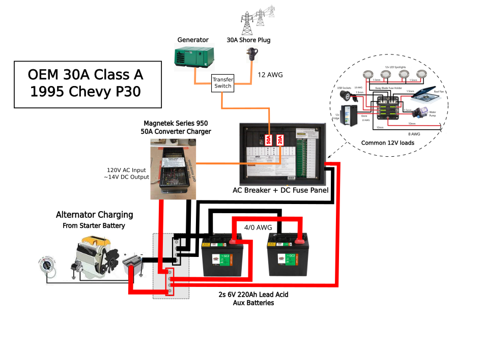
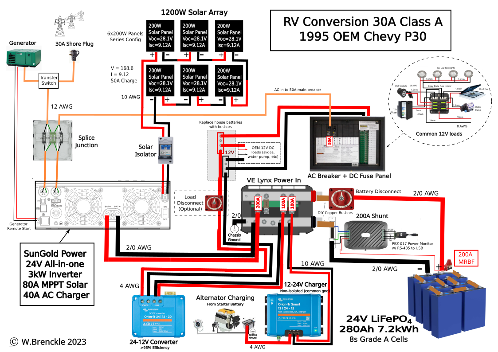
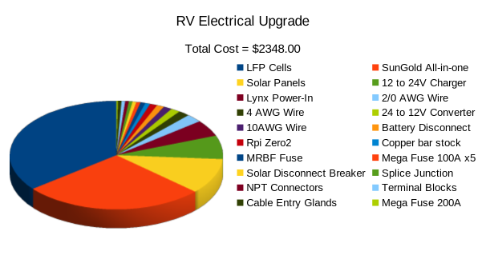

# RV Electrical Conversion / Upgrade

## OEM 1995 Chevy P30 30A

Goal of this project is to completely upgrade the electrical system of this 30A OEM Chevy P30. The stock OEM electrical system is shown in the diagram below:

The primary flaw in the OEM config is the Magnetek Series 950 Converter being unable to do any smart charging of the batteries, so when the RV is plugged into shore power it is very slow to charge the aux batteries and if the RV stays plugged in for an extended period it will overcharge the starter battery, causing it to wear out and be unable to start the RV.

## Planned Conversion to LiFePO4 and Solar

The major upgrades of this conversion are as follows:
1. Replace the 2 series connected 6V lead acid Aux batteries with 8 LiFePO4 cells in a series configuration, creating a 24V 280Ah battery bank with a power capacity of 7.2kWh.  Moving from 12V to 24V for the house battery increases the power density of the whole system and enables the system to be wired with thinner cables which cuts down on cost.  This homemade battery will be managed using the latest version of the [diyBMS v4](https://github.com/stuartpittaway/diyBMSv4).
2. Remove the Magnetek power converter from the system completely and replace it with a combination of two new chargers.  The first charger is a 12V to 24V charger that will convert the alternator output to a useful voltage to charge the house batteries while driving, and the second is the charger from the all-in-one solar inverter charger that will keep the house batteries topped off while not overcharging the starter battery when the RV is plugged in for extended periods.     
3. Install at least 1200W of solar panels (will increase to 1400-1500W if a 7th panel can fit on the roof of the RV).  Panels will be mounted in a way that allows them to be tilted toward the sun when it is lower in the sky during the winter, thus increasing the solar power generated by roughly 50%.
4. The system will be managed by the SunGold Power All-in-one Solar Charge Inverter which combines a 40A pass-through AC battery charger with an 80A MPPT solar charge controller and a 3000W inverter.
5. For ease of routing and cable management a Victron Lynx Power-In will be modified to function identically to a Victron Lynx Distributor.
6. A current shunt and power monitor will be installed to measure current flowing into and out of the battery and will be able to report back the battery state of charge to a Raspberry Pi.  The RPi will be running the open source Venus OS that provides all the  functionallity of the Victron Cerbo GX.
7. Lastly a 24V to 12V DC voltage regulator will be needed to step down the 24V from the battery bank to power the existing 12V infrastructure.
   
The system diagram after the conversion is shown below.

## Cost savings

A major goal of this project is to keep cost as low as possible without sacrificing functionality or performance.  All in all a total cost of under $2,500 for this project (not counting any of my labor), is very inexpensive when compared to the cost to have an equivalent system installed.  Conservatively the price of an equivalent solution would be $12,000 or more.  

The key areas where cost was saved:

1. Building the 24V battery from individual cells instead of buying pre-assembled Lithium batteries saved roughly 50% on the cost and allowed us to use a better BMS that will monitor all the individual cells and keep them all balanced, thus increasing performance and extending their life.
2. Searching online for used solar panels.  I found 7 panels on OfferUp that would produce 1470W of solar power for only $250, which is almost the price to buy just 1 new 200-210W panel.
3. Using Victron equipment only where it made sense, not for every system component, and when we did use Victron we bought that equipment used. For example, the Victron Multiplus inverter costs $1,300 and does not include a solar charge controller, whereas the SunGold All-in-one with the same specs plus an 80A MPPT solar controller costs only $649.
4. Using a Raspberry Pi for the system monitoring and reporting along with a cheap display.  Those two components together cost less than $50, versus buying a Victron Cerbo GX and Cerbo Screen would cost over $600.
   
As you can see the from the total cost breakdown below the batteries and the SunGold All-in-one each are roughly 1/3 of the total cost and all the remaining components make up the last 1/3 of the total.

| Part     |      Manufacturer      |  Cost |
|----------|:-------------:|------:|
|LFP 280Ah Cells x8 | EVE | $842 |
| All-In-One Solar Charge Inverter |  Sungold Power | $649 |
| 210W Solar Panels x7 (used) | Sunpower | $250
| Orion 12-24V Charger (used)| Victron  Energy   |   $166 |
| Lynx Power-In (used) | Victron Energy |    $115 |
| Orion 24-12V Converter (used)| Victron Energy| $34 |
|  |  | $2,056 |

The complete listing of all the parts used and considered can be found [here]( RV_upgrade_pricing.xlsx).

## License

This work is licensed under a Creative Commons Attribution-NonCommercial-ShareAlike 4.0 International License.

https://creativecommons.org/licenses/by-nc-sa/4.0/deed.en

You are free to:

* Share — copy and redistribute the material in any medium or format
* Adapt — remix, transform, and build upon the material
The licensor cannot revoke these freedoms as long as you follow the license terms.

Under the following terms:
* Attribution — You must give appropriate credit, provide a link to the license, and indicate if changes were made. You may do so in any reasonable manner, but not in any way that suggests the licensor endorses you or your use.
* Non-Commercial — You may not use the material for commercial purposes.
* ShareAlike — If you remix, transform, or build upon the material, you must distribute your contributions under the same license as the original.
* No additional restrictions — You may not apply legal terms or technological measures that legally restrict others from doing anything the license permits.

Notices:
You do not have to comply with the license for elements of the material in the public domain or where your use is permitted by an applicable exception or limitation.

No warranties are given. The license may not give you all of the permissions necessary for your intended use. For example, other rights such as publicity, privacy, or moral rights may limit how you use the material.

